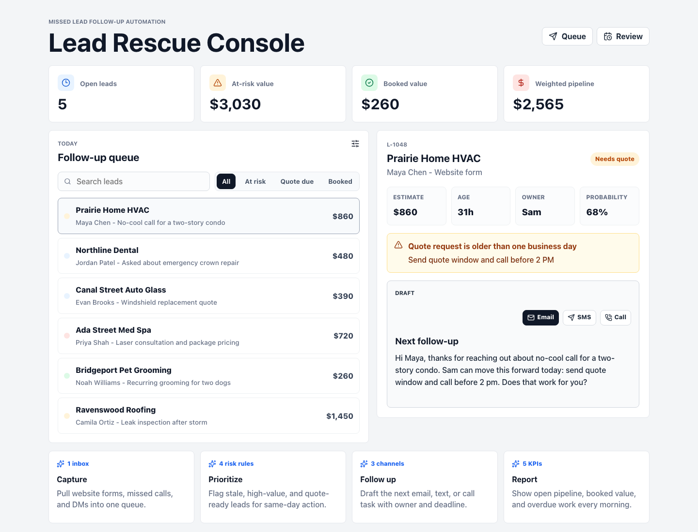

# Missed Lead Follow-Up Automation Demo

A truth-safe portfolio artifact for pitching small business automation work.

This repo shows a working prototype for a "lead rescue" workflow: inbound requests are captured in one queue, scored for follow-up risk, assigned to an owner, and turned into draft email, SMS, or call tasks. The sample data is fictional and intentionally marked as demo data.

## Live Demo

https://dodhon.github.io/missed-lead-followup-demo/

## What Is Included

- React + TypeScript dashboard for inspecting open leads, stale quotes, booked value, and follow-up drafts.
- Fictional sample data in `data/sample-leads.csv`.
- Follow-up rules in `data/followup-rules.csv`.
- System diagram in `docs/system-diagram.md`.
- Walkthrough script in `docs/demo-script.md`.
- Packaged service offer in `docs/package-offer.md`.
- Deployment notes in `docs/deployment.md`.
- Reusable proposal snippets in `proposals/upwork-proposals.md`.

## Screenshot



## Run Locally

```bash
npm install
npm run dev
```

For a production build:

```bash
npm run build
npm run preview
```

## Demo Positioning

This is designed to support outreach to service businesses with high-intent inbound leads: HVAC, dental, auto glass, med spas, roofers, groomers, and similar operators.

The buyer-facing claim is deliberately narrow:

> I can build a lightweight follow-up system that turns missed calls, website forms, and quote requests into a prioritized daily queue with draft replies and owner accountability.

## Boundaries

- This is a prototype, not a live client implementation.
- The data is fictional and should not be represented as a real business result.
- No external CRM, email, SMS, or payment credentials are included.
- A real deployment would connect to the client's actual form, inbox, call tracking, CRM, or spreadsheet stack.

## Next Implementation Path

1. Replace the fictional CSV with a client's current lead spreadsheet or inbox export.
2. Confirm lead stages, owners, and follow-up timing rules.
3. Connect the intake source: website form, Gmail label, CRM export, missed call feed, or Airtable.
4. Add notification delivery through the client's existing email, Slack, SMS, or task tool.
5. Ship a daily dashboard plus a weekly report of stale leads, booked leads, and follow-up completion.
