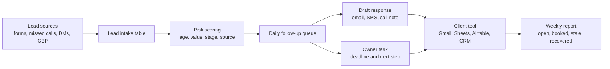

# System Diagram

## Implementation Notes

- The prototype uses static fictional data so it can be reviewed without credentials.
- A client version can start with Google Sheets or Airtable before adding CRM integrations.
- The first paid build should stay narrow: one intake source, one queue, three to five follow-up rules, and one weekly report.
